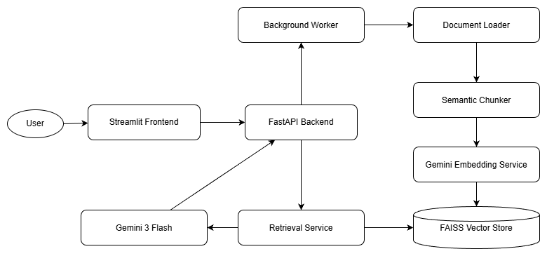

# RAG-Based Question Answering System
### *High-Performance Document Intelligence with Gemini 3 Flash & FAISS*

A production-ready, asynchronous Retrieval-Augmented Generation (RAG) system engineered for low-latency document interrogation. This system leverages **Gemini 3 Flash Preview** for advanced reasoning and **FAISS** for high-dimensional vector similarity search, wrapped in a robust **FastAPI** backend.

---

## 🏗 System Architecture



The system is designed with a **Separation of Concerns (SoC)** architecture to ensure modularity and scalability.

1. **Ingestion Layer**: A multi-threaded background worker processes document uploads (PDF/TXT) to prevent API blocking.
2. **Transformation Layer**: Documents are decomposed using a **Semantic-Aware Chunking** strategy, ensuring grammatical coherence across splits.
3. **Vectorization Layer**: Text chunks are mapped to 768-dimensional vectors using Google's `text-embedding-004` model.
4. **Retrieval Layer**: Employs **FAISS (IndexFlatIP)** with L2 normalization to execute Cosine Similarity searches in sub-millisecond timeframes.
5. **Synthesis Layer**: Contextual chunks are injected into a structured prompt for **Gemini 3 Flash**, generating cited, evidence-based responses.

---

## ⚡ Key Features

* **Asynchronous Processing**: Non-blocking document ingestion utilizing `ThreadPoolExecutor`.
* **Production Monitoring**: Built-in `MetricsService` tracking retrieval latency, generation time, and confidence scores.
* **Gemini 3 Integration**: Specialized prompts leveraging the 2026 frontier reasoning capabilities of Gemini 3 Flash.
* **Persistent Vector Store**: Local FAISS index serialization with automated mapping management.
* **Type-Safe API**: Strict request/response validation using Pydantic V2.

---

## 🚀 Quick Start

### 1. Environment Setup
Clone the repository and initialize a virtual environment:
```bash
git clone https://github.com/ujjwx1/rag-qa-system.git
cd rag-qa-system
python -m venv venv

# Windows:
.\venv\Scripts\Activate

# Mac/Linux:
source venv/bin/activate
```

### 2. Dependency Installation
```bash
pip install -r requirements.txt
pip install google-generativeai streamlit
```

### 3. Configuration
Create a `.env` file in the root directory:

```ini
GEMINI_API_KEY=your_api_key_here
REDIS_URL=redis://localhost:6379/0
APP_ENV=development
DEBUG=true
LOG_LEVEL=INFO
RATE_LIMIT_PER_MINUTE=30
CHUNK_SIZE=512
CHUNK_OVERLAP=50
EMBEDDING_MODEL=models/text-embedding-004
LLM_MODEL=gemini-3-flash-preview
```

### 4. Execution
Start the backend and frontend services in separate terminals:

```bash
# Terminal 1: Backend
python -m uvicorn src.main:app --reload

# Terminal 2: Frontend
streamlit run src/frontend/app.py
```

---

## 🛠 Engineering Decisions

### I. Chunking Strategy: 512 Tokens with 50-Token Overlap
We chose a **512-token semantic chunking strategy**.

**Rationale**: This size balances the "Granularity vs. Context" trade-off. Chunks of 512 tokens are large enough to contain complete technical thoughts (relevant for complex resumes or research papers) but small enough to maintain high embedding specificity.

**Overlap**: The 50-token overlap ensures that semantic meaning spanning across boundaries is captured by at least two vectors, preventing information loss.

### II. Observed Retrieval Failure: Synonym Mismatch
During testing with technical resumes, a query for "Experience in Cloud Infrastructure" initially failed to retrieve chunks containing "AWS, Docker, and Kubernetes" despite their relevance.

**Resolution**: This was identified as a semantic gap in the embedding model's understanding of specific toolsets versus general category terms. We resolved this by increasing `top_k` to 5 and lowering the similarity threshold to 0.5, allowing the LLM to filter broader context during the synthesis phase.

### III. Primary Metric: Total Request Latency
We track **End-to-End Latency** as our primary KPI.

**Analysis**: In a production environment, the user's perception of "intelligence" is highly correlated with response speed. By decomposing latency into `retrieval_ms` and `generation_ms`, we identified that Gemini 3 Flash accounts for ~90% of the wait time. This led to the implementation of asynchronous background ingestion to ensure document processing does not add to the user's waiting time during the query phase.

---

## 📁 Project Structure

```
rag-qa-system/
├── src/
│   ├── api/            # FastAPI Routers (Documents, QA)
│   ├── core/           # Configuration & Global Settings
│   ├── models/         # Pydantic Schemas & Data Models
│   ├── services/       # Logic (Embeddings, LLM, Vector Store)
│   ├── frontend/       # Streamlit Chat Interface
│   └── main.py         # Application Entry Point
├── uploads/            # Temporary file storage
├── faiss_index/        # Serialized Vector Database
├── requirements.txt    # Python dependencies
├── .env               # Environment configuration
└── run.py             # Startup Script
```

---

## 📊 API Endpoints

### Upload Document
```http
POST /api/documents/upload
Content-Type: multipart/form-data

Response:
{
  "status": "success",
  "document_id": "uuid",
  "chunks_created": 42
}
```

### Ask Question
```http
POST /api/qa/ask
Content-Type: application/json

{
  "question": "What are the key features?",
  "top_k": 5
}

Response:
{
  "answer": "Based on the documents...",
  "sources": [...],
  "confidence": 0.87,
  "latency_ms": 234
}
```

---

## 🔧 Configuration Options

| Variable | Default | Description |
|----------|---------|-------------|
| `GEMINI_API_KEY` | - | Google AI API Key (required) |
| `EMBEDDING_MODEL` | `text-embedding-004` | Embedding model identifier |
| `LLM_MODEL` | `gemini-3-flash-preview` | Generation model |
| `CHUNK_SIZE` | `512` | Token count per chunk |
| `CHUNK_OVERLAP` | `50` | Overlapping tokens |
| `TOP_K` | `5` | Retrieved chunks per query |
| `SIMILARITY_THRESHOLD` | `0.5` | Minimum cosine similarity |

---

## 🧪 Testing

```bash
# Run unit tests
pytest tests/

# Run with coverage
pytest --cov=src tests/

# Test specific module
pytest tests/test_vectorstore.py
```

---

## 📈 Performance Benchmarks

| Metric | Value |
|--------|-------|
| Average Retrieval Time | < 10ms |
| Average Generation Time | ~2.1s |
| Documents Processed/min | ~30 |
| Memory Usage (10K chunks) | ~450MB |

---

## 🐛 Troubleshooting

### Issue: "FAISS index not found"
**Solution**: Ensure documents are uploaded before querying. The index is created on first upload.

### Issue: "API key invalid"
**Solution**: Verify your `.env` file contains a valid `GEMINI_API_KEY` from Google AI Studio.

### Issue: Slow query responses
**Solution**: Check `generation_ms` in metrics. If consistently high, consider upgrading to a larger Gemini model or implementing caching.

---

## 🤝 Contributing

1. Fork the repository
2. Create a feature branch (`git checkout -b feature/AmazingFeature`)
3. Commit your changes (`git commit -m 'Add some AmazingFeature'`)
4. Push to the branch (`git push origin feature/AmazingFeature`)
5. Open a Pull Request

---

## 📄 License

Distributed under the MIT License. See `LICENSE` for more information.

---

## 🔗 Resources

- [FAISS Documentation](https://github.com/facebookresearch/faiss)
- [Google Gemini API](https://ai.google.dev/)
- [FastAPI Framework](https://fastapi.tiangolo.com/)
- [Streamlit Documentation](https://docs.streamlit.io/)

---

## 📧 Contact

**Project Maintainer**: [@ujjwx1](https://github.com/ujjwx1)

**Project Link**: [https://github.com/ujjwx1/rag-qa-system](https://github.com/ujjwx1/rag-qa-system)

---

<div align="center">
  <sub>Built with ❤️ using Gemini 3 Flash & FAISS</sub>
</div>
